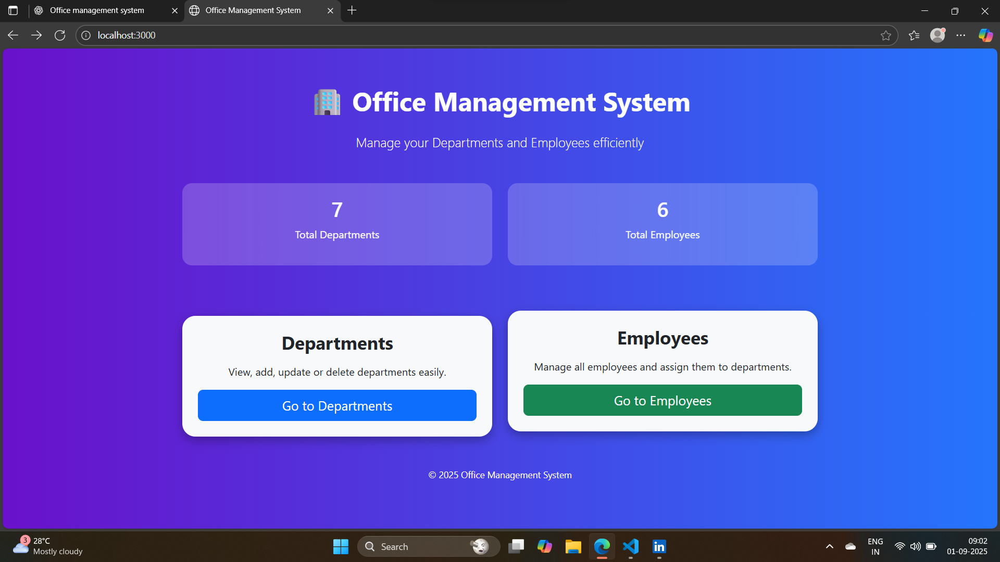
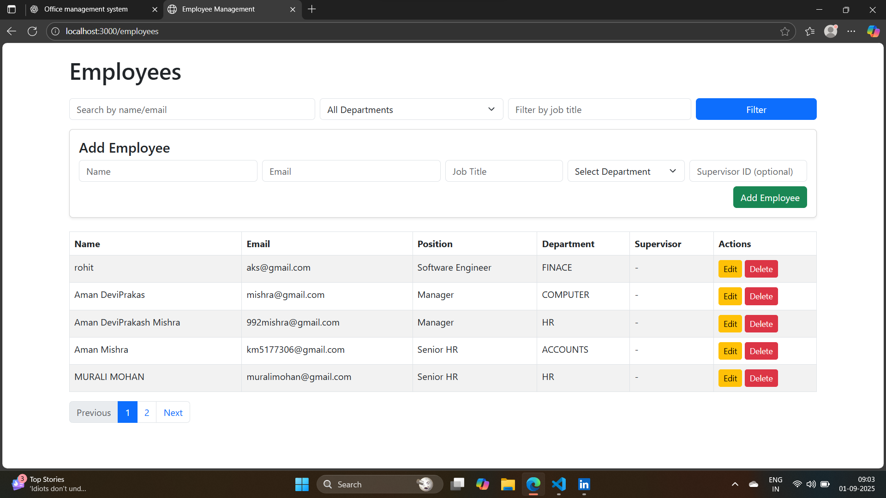
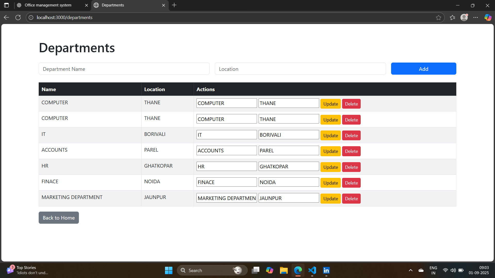

# Office Management System 🏢

A simple **Office Management System** built with Node.js, Express, MongoDB, and EJS.  
This project allows you to manage **Departments** and **Employees** with full CRUD operations.

---

## Features
- Manage Departments (Add, Edit, Delete)
- Manage Employees (Add, Edit, Delete)
- Employee ↔ Department relationships
- Employee supervisor selection
- Pagination, search & filter
- Dynamic Country/State/City selection via API
- Clean UI with EJS + Bootstrap/Tailwind

---

## Screenshots
### Home Page


### Employees Page


### Department Page


---

## Tech Stack
- **Backend**: Node.js, Express.js
- **Database**: MongoDB + Mongoose
- **Frontend**: EJS + Bootstrap/Tailwind CSS
- **External API**: Axios (for location data)

---

## Installation & Setup

1. **Clone the repository**
```bash
git clone https://github.com/your-username/office-management-system.git
 cd office-management-system
